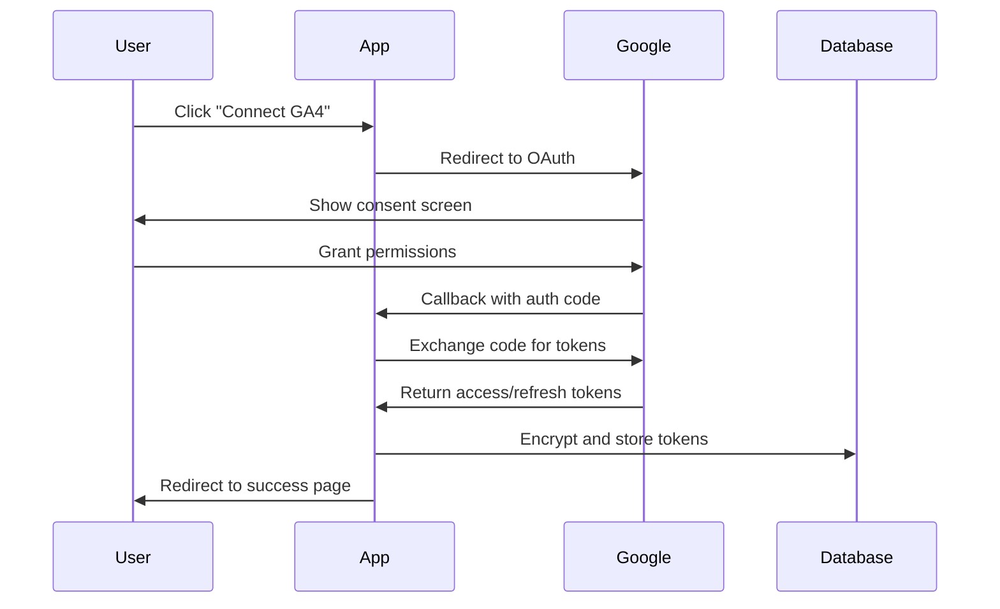

# 🎯 GA4 Integration Implementation Guide

## Overview
This document provides a comprehensive guide for implementing and using the GA4 Integration feature in the Rylie SEO Hub. The integration enables agencies to connect their Google Analytics 4 properties and schedule automated SEO reports.

## 🚀 Quick Start

### Prerequisites
1. Google Cloud Console project with Analytics API enabled
2. OAuth 2.0 credentials configured
3. PostgreSQL database setup
4. Environment variables configured

### Environment Setup

```bash
# 1. Generate encryption key for token storage
openssl rand -hex 32

# 2. Add to your .env file
GOOGLE_CLIENT_ID="your-google-oauth-client-id"
GOOGLE_CLIENT_SECRET="your-google-oauth-client-secret"
ENCRYPTION_KEY="your-64-character-hex-key"
NEXTAUTH_URL="https://yourdomain.com"  # or http://localhost:3001 for dev

# 3. Optional: Service account for server-side access
GA4_SERVICE_ACCOUNT_KEY='{"type":"service_account",...}'
```

### Installation

```bash
# Install dependencies
npm install @radix-ui/react-select @radix-ui/react-dialog

# Run database migrations
npm run db:push

# Generate Prisma client
npm run db:generate
```

## 🔧 Google Cloud Console Setup

### 1. Enable Analytics API
1. Go to [Google Cloud Console](https://console.cloud.google.com/)
2. Select your project or create a new one
3. Navigate to "APIs & Services" > "Library"
4. Search and enable:
   - Google Analytics Reporting API
   - Google Analytics Admin API

### 2. Create OAuth 2.0 Credentials
1. Go to "APIs & Services" > "Credentials"
2. Click "Create Credentials" > "OAuth 2.0 Client IDs"
3. Application type: "Web application"
4. Add authorized redirect URI:
   - Development: `http://localhost:3001/api/ga4/auth/callback`
   - Production: `https://yourdomain.com/api/ga4/auth/callback`
5. Copy Client ID and Client Secret to your `.env` file

### 3. Configure OAuth Consent Screen
1. Go to "APIs & Services" > "OAuth consent screen"
2. Choose "External" (for public use) or "Internal" (for organization only)
3. Fill required fields:
   - App name: "Rylie SEO Hub"
   - User support email: Your email
   - Scopes: Add `analytics.readonly` and `analytics.edit`

## 📱 User Flow

### 1. Connection Process


### 2. Property Selection
1. User connects GA4 account via OAuth
2. App fetches available properties using GA4 Admin API
3. User selects property from dropdown
4. Selected property ID/name saved to agency record

### 3. Report Scheduling
1. User navigates to schedule management
2. Creates new schedule with:
   - Report type (Weekly/Monthly/Quarterly)
   - Frequency (cron pattern)
   - Email recipients
   - Branding options
3. Schedule stored in database
4. Cron job processes schedules and generates reports

## 🔒 Security Implementation

### Token Encryption
```typescript
// Encryption process
const crypto = require('crypto')
const algorithm = 'aes-256-cbc'
const key = Buffer.from(process.env.ENCRYPTION_KEY!, 'hex')

function encryptToken(token: string): string {
  const iv = crypto.randomBytes(16)
  const cipher = crypto.createCipher(algorithm, key)
  let encrypted = cipher.update(token, 'utf8', 'hex')
  encrypted += cipher.final('hex')
  return iv.toString('hex') + ':' + encrypted
}

function decryptToken(encryptedToken: string): string {
  const parts = encryptedToken.split(':')
  const iv = Buffer.from(parts[0], 'hex')
  const encryptedData = parts[1]
  const decipher = crypto.createDecipher(algorithm, key)
  let decrypted = decipher.update(encryptedData, 'hex', 'utf8')
  decrypted += decipher.final('utf8')
  return decrypted
}
```

### Access Control
- All API endpoints require authenticated session
- Agency-based data isolation
- User role validation for admin functions
- Property access validation against user's permissions

## 📊 Database Schema

### UserGA4Token Model
```prisma
model UserGA4Token {
  id                    String    @id @default(cuid())
  userId                String    @unique
  encryptedAccessToken  String    @db.Text
  encryptedRefreshToken String?   @db.Text
  expiryDate           DateTime?
  scope                String?
  tokenType            String?
  createdAt            DateTime  @default(now())
  updatedAt            DateTime  @updatedAt
  user                 User      @relation(fields: [userId], references: [id], onDelete: Cascade)
}
```

### ReportSchedule Model
```prisma
model ReportSchedule {
  id                  String    @id @default(cuid())
  agencyId           String
  cronPattern        String
  ga4PropertyId      String
  userId             String
  reportType         String    // WeeklySummary, MonthlyReport, QuarterlyBusinessReview
  emailRecipients    String[]
  brandingOptionsJson String?   @db.Text
  isActive           Boolean   @default(true)
  lastRun            DateTime?
  nextRun            DateTime?
  createdAt          DateTime  @default(now())
  updatedAt          DateTime  @updatedAt
  agency             Agency    @relation(fields: [agencyId], references: [id], onDelete: Cascade)
  user               User      @relation(fields: [userId], references: [id], onDelete: Cascade)
}
```

## 🛠️ API Endpoints

### Authentication
- `GET /api/ga4/auth` - Initiate OAuth flow
- `GET /api/ga4/auth/callback` - Handle OAuth callback
- `POST /api/ga4/disconnect` - Disconnect GA4 account

### Property Management
- `GET /api/ga4/properties` - List user's GA4 properties
- `POST /api/ga4/connect` - Connect selected property
- `GET /api/agencies/current` - Get current agency info

### Report Scheduling
- `GET /api/reports/schedules` - List all schedules
- `POST /api/reports/schedules` - Create new schedule
- `PUT /api/reports/schedules/[id]` - Update schedule
- `DELETE /api/reports/schedules/[id]` - Delete schedule
- `POST /api/reports/test` - Generate test report

## 🎨 UI Components

### Pages
- `/settings/ga4` - Main GA4 settings page
- `/settings/ga4/schedules` - Report schedule management

### Key Components
- **Select** - Accessible dropdown for property selection
- **Dialog** - Modal forms for schedule creation/editing
- **Toast** - User feedback notifications
- **ScheduleForm** - Comprehensive form for report configuration

## 🔄 Report Generation Process

### Data Collection
```typescript
const ga4Service = new GA4Service(accessToken)
const seoMetrics = await ga4Service.getSEOMetrics(propertyId)
const topPages = await ga4Service.getTopPages(propertyId)
const searchQueries = await ga4Service.getSearchQueries(propertyId)
```

### Report Types
1. **Weekly Summary**: Key metrics and top pages
2. **Monthly Report**: Comprehensive SEO performance
3. **Quarterly Business Review**: Executive summary with trends

### Email Generation
- HTML template with agency branding
- Dynamic content based on GA4 data
- Responsive design for mobile viewing
- PDF attachment option

## 🚨 Error Handling

### Common Scenarios
1. **Token Expiration**: Automatic refresh using refresh token
2. **Insufficient Permissions**: Clear error message with required scopes
3. **Property Access Denied**: Validation and user feedback
4. **API Rate Limits**: Retry logic with exponential backoff
5. **Network Failures**: Graceful degradation and retry

### Error Messages
```typescript
const errorMessages = {
  NO_TOKEN: 'No GA4 access token found. Please connect your GA4 account first.',
  EXPIRED_TOKEN: 'Your GA4 access token has expired. Please reconnect your account.',
  INSUFFICIENT_PERMISSIONS: 'Insufficient permissions. Please grant analytics access.',
  PROPERTY_NOT_FOUND: 'GA4 property not found or access denied.',
  RATE_LIMIT: 'Too many requests. Please try again later.',
}
```

## 🧪 Testing

### Manual Testing Checklist
- [ ] OAuth connection flow
- [ ] Property selection and saving
- [ ] Schedule creation/editing/deletion
- [ ] Test report generation
- [ ] Error handling scenarios
- [ ] Mobile responsiveness
- [ ] Agency isolation

### Test Data Setup
```bash
# Create test agency and user
npm run setup-user-agency

# Generate test schedules
node scripts/create-test-schedules.js
```

## 🚀 Deployment

### Environment Variables
Ensure all required environment variables are set in production:
```bash
GOOGLE_CLIENT_ID=prod-client-id
GOOGLE_CLIENT_SECRET=prod-client-secret
ENCRYPTION_KEY=prod-encryption-key
NEXTAUTH_URL=https://yourdomain.com
DATABASE_URL=postgresql://...
```

### Database Migration
```bash
# Run in production
npm run db:migrate
npm run db:generate
```

### Monitoring
- Monitor OAuth callback success/failure rates
- Track report generation failures
- Set up alerts for token expiration
- Monitor API rate limit usage

## 🔧 Troubleshooting

### Common Issues

1. **"Authentication failed" Error**
   - Check Google OAuth credentials
   - Verify redirect URI configuration
   - Ensure Analytics API is enabled

2. **"No properties found" Error**
   - Verify user has GA4 properties
   - Check Analytics permissions
   - Ensure properties are GA4 (not Universal Analytics)

3. **Token Decryption Failed**
   - Verify ENCRYPTION_KEY is correct
   - Check for key rotation issues
   - Ensure key is 64 hex characters

4. **Schedule Creation Fails**
   - Verify GA4 property is connected
   - Check email recipient validation
   - Ensure user has agency association

### Debug Mode
```typescript
// Enable debug logging
process.env.DEBUG = 'ga4:*'

// Check token status
const token = await getDecryptedToken(userId)
console.log('Token status:', {
  hasToken: !!token,
  tokenLength: token?.length,
  expiresAt: tokenRecord?.expiryDate
})
```

## 📈 Future Enhancements

### Planned Features
1. **Advanced Scheduling**: Custom cron patterns
2. **Report Templates**: Customizable report formats
3. **Data Export**: CSV/Excel export options
4. **Multi-Property**: Support for multiple GA4 properties
5. **Real-time Alerts**: Threshold-based notifications
6. **Dashboard Widgets**: Embedded GA4 charts

### API Improvements
1. **Batch Operations**: Bulk schedule management
2. **Webhook Support**: External system integration
3. **Rate Limiting**: Built-in request throttling
4. **Caching**: Redis-based response caching

## 📞 Support

For issues or questions:
1. Check this documentation first
2. Review error logs in console
3. Test with minimal reproduction case
4. Contact development team with:
   - Error messages
   - Steps to reproduce
   - Browser/environment info
   - User ID and agency ID

---

**Last Updated**: December 2024  
**Version**: 1.0.0  
**Maintainer**: SEO Werks Development Team